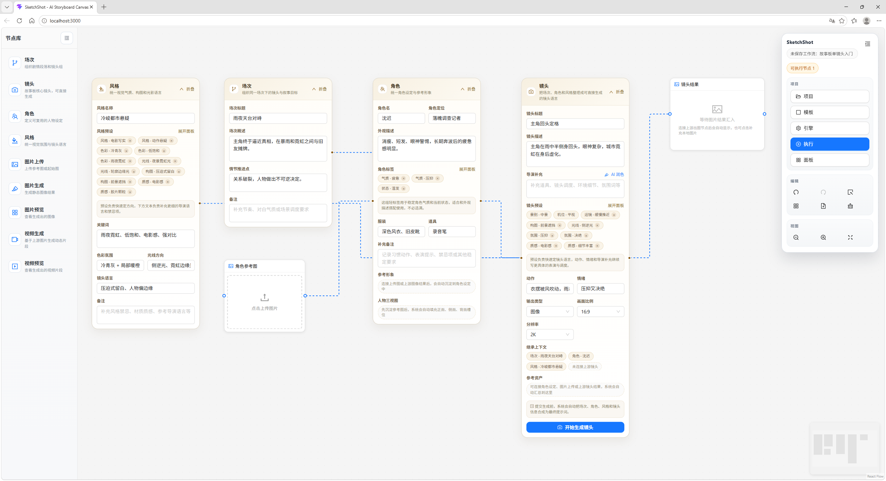
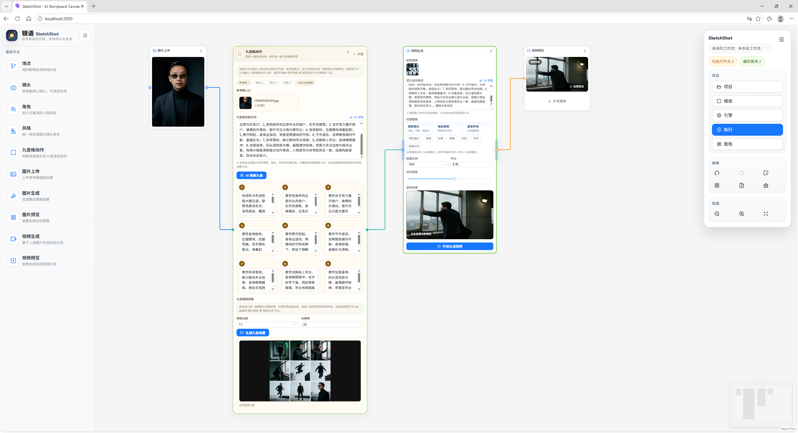
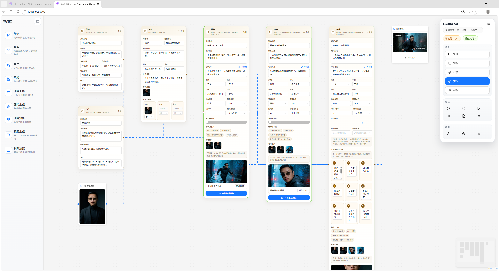

# SketchShot

[](./LICENSE)

SketchShot 是一个面向影视分镜、角色设定与 AI 视觉生成的节点式创作工具。它把场次、角色、风格、镜头、连续镜头、三视图、图像生成、视频生成、TTS 语音合成、数字人、视频编辑与结果预览放到同一张无限画布里，让创作、迭代和复用都围绕一个可视化工作流展开。

> 仓库当前采用 `GNU Affero General Public License v3.0 or later (AGPL-3.0-or-later)` 开源协议发布，当前文档以中文为主。
> 如果你修改本项目并通过网络向用户提供服务，需要按照 AGPL 的要求提供对应源代码。详见 [LICENSE](./LICENSE)。

## 界面预览







## 功能亮点

- **节点式故事板工作流**：场次、角色、风格、镜头与生成节点可自由编排。
- **角色一致性**：角色节点支持多视图输入，适合跨镜头复用角色设定；新增角色库节点支持预设角色管理与一键调用。
- **三视图生成节点**：可基于单张参考图生成三视图，支持输出拼图或三张独立图，并直接接入角色节点。
- **连续镜头创作**：支持首帧 / 尾帧约束、动作节拍与视频生成链路。
- **视频生成与编辑**：支持文生视频、图生视频，以及视频修改（Video Edit）、视频拼接（Video Concat）、视频上传节点。
- **TTS 语音合成**：内置 TTS 节点，支持多音色选择与声音克隆（Voice Clone），可将文本转为语音并接入数字人链路。
- **数字人节点**：支持虚拟数字人视频生成，结合 TTS 或音频输入驱动口型与动作。
- **图像理解节点**：基于多模态模型对图片进行描述、分析，产出文本提示词供下游节点使用。
- **图像放大节点**：对生成或上传的图片进行超分辨率放大处理。
- **动画混合节点**：支持多段动画/视频的混合与过渡编排。
- **版本对比与资产沉淀**：同一镜头可多次生成并对比结果，素材可沉淀到项目内继续复用。
- **模板与项目持久化**：支持官方模板、本地保存、项目导入导出。
- **多运行模式**：支持本地开发、Docker Compose、离线交付脚本、Green Bundle 独立部署与 LazyCat 平台部署。

## 技术栈

- 前端：React 19、React Flow、Zustand、Ant Design、Vite
- 后端：FastAPI、Pydantic、WebSocket
- AI 适配器：Volcengine（即梦/豆包/Seedance）、HappyHorse、ComfyUI、WanX、Mock
- 语音服务：DashScope TTS、火山引擎 TTS、声音克隆
- 工程化：Docker Compose、PowerShell 脚本、Vitest、Python unittest

## 仓库结构

```text
SketchShot/
├── frontend/                  React 前端
│   └── src/
│       ├── components/        画布、节点（20+ 节点类型）、面板、上下文菜单
│       ├── services/          API、WebSocket、各节点生成与工作流执行封装
│       ├── stores/            Zustand 状态管理
│       ├── templates/         官方工作流模板
│       └── utils/             导入导出、布局、连接规则、生成签名、执行辅助
├── backend/                   FastAPI 后端
│   ├── app/
│   │   ├── adapters/          AI 适配器（Volcengine / HappyHorse / ComfyUI / WanX / Mock）
│   │   ├── api/               HTTP / WebSocket 接口
│   │   ├── models/            请求与响应模型
│   │   └── services/          工作流、任务、模板、引擎配置、TTS、声音克隆、媒体资产
│   ├── tests/                 后端测试
│   └── data/                  运行期数据目录（已忽略生成产物）
├── scripts/                   Docker、离线包、启动与校验脚本
├── lazycat/                   LazyCat 平台部署配置
├── docs/                      公开维护文档
├── docker-compose.yml
└── docker-compose.offline.yml
```

更细的维护入口见 [docs/project-structure.md](./docs/project-structure.md)。

## 路线图

- 公开版路线图见 [ROADMAP.md](./ROADMAP.md)
- 首次发布 GitHub 的操作建议见 [docs/first-publish-guide.md](./docs/first-publish-guide.md)

## 快速开始

### 本地开发

1. 准备后端配置：

   ```powershell
   Copy-Item backend\.env.example backend\.env
   ```

   如果暂时没有火山引擎配置，可将 `backend/.env` 中的 `DEFAULT_ADAPTER` 改为 `mock`。

2. 启动后端：

   ```powershell
   Set-Location .\backend
   pip install -r requirements.txt
   python run.py
   ```

3. 启动前端：

   ```powershell
   Set-Location ..\frontend
   npm install
   npm run dev
   ```

4. 默认访问地址：

- 前端：`http://localhost:3000/`
- 后端健康检查：`http://localhost:8000/api/health`

前端开发环境默认通过 Vite 代理 `/api`、`/ws`、`/uploads`、`/outputs`，通常不需要额外设置 API 地址。如需自定义，可参考 `frontend/.env.example` 与 `frontend/.env.production.example` 创建本地配置文件。

### Docker Compose

```powershell
Copy-Item .env.docker.example .env.docker
.\scripts\docker-build.ps1 -Action up
```

默认访问地址：

- 前端：`http://localhost:8080/`
- 后端健康检查：`http://localhost:8000/api/health`

如果端口被占用，请调整 `.env.docker` 中的映射值，或修改本地运行配置。

## 配置说明

- `backend/.env.example`：本地开发默认配置模板。
- `.env.docker.example`：Docker Compose 在线运行示例配置。
- `.env.offline.example`：离线部署参考配置。
- `backend/data/engine_config.json`：前端工具栏保存的引擎配置，属于本地运行数据，已加入忽略列表。

说明：
- Docker 相关环境变量目前仍保留 `WXHB_` 前缀，用于兼容现有离线交付和脚本链路，不影响公开使用。

火山引擎相关参数支持两种配置方式：

- 在 `.env` / `.env.docker` 中预置默认值，适合首启或无人值守部署。
- 在前端“工具栏 -> 引擎”里保存运行配置，适合日常调试与多模型切换。

## 开发与验证

后端测试：

```powershell
python -m unittest discover -s backend/tests -p "test_*.py"
```

前端测试与构建：

```powershell
Set-Location .\frontend
npm test
npm run build
```

## 维护文档

- [CONTRIBUTING.md](./CONTRIBUTING.md)
- [CODE_OF_CONDUCT.md](./CODE_OF_CONDUCT.md)
- [SECURITY.md](./SECURITY.md)
- [SUPPORT.md](./SUPPORT.md)
- [ROADMAP.md](./ROADMAP.md)
- [docs/project-structure.md](./docs/project-structure.md)
- [docs/open-source-checklist.md](./docs/open-source-checklist.md)
- [docs/first-publish-guide.md](./docs/first-publish-guide.md)
- [docs/tts-api-usage.md](./docs/tts-api-usage.md)
- [docs/standalone-guide.md](./docs/standalone-guide.md)
- [docs/green-bundle-guide.md](./docs/green-bundle-guide.md)

## GitHub 协作

- 仓库已补充 Issue 模板、PR 模板和基础 CI，便于公开协作。
- CI 当前会自动执行后端单元测试，以及前端测试和生产构建。
- 欢迎提交 Issue、PR 和复现步骤清晰的 bug 反馈；贡献代码默认需遵守本仓库的 AGPL 协议。
- 如果你基于 SketchShot 做公开分发或网络服务，请在显著位置保留源代码获取方式，方便用户了解和获取对应源码。

## 联系作者

如需交流产品想法、反馈使用体验，或沟通合作与定制需求，可扫码添加个人微信，建议备注 `SketchShot`。

<p>
  
</p>

## 许可说明

- 本仓库采用 `AGPL-3.0-or-later` 开源协议发布。
- 允许：使用、学习、修改、分发和二次开发，但需要遵守 AGPL 条款。
- 如果你分发修改版，或将修改版作为网络服务对外提供，需要向用户提供对应源代码。
- 请保留原有版权与许可证声明。
- 具体条款以 [LICENSE](./LICENSE) 为准。
